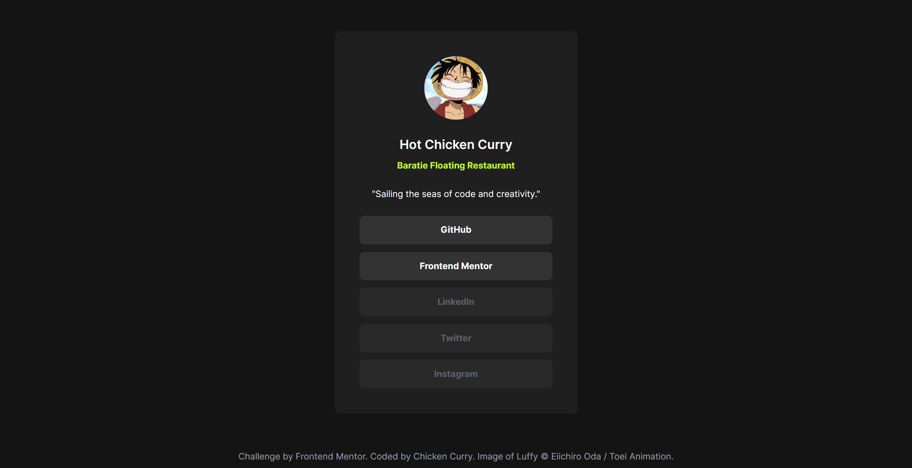

# Frontend Mentor - Social links profile solution

This is a solution to the [Social links profile challenge on Frontend Mentor](https://www.frontendmentor.io/challenges/social-links-profile-UG32l9m6dQ). Frontend Mentor challenges help you improve your coding skills by building realistic projects. 

## Table of contents

- [Overview](#overview)
  - [The challenge](#the-challenge)
  - [Screenshot](#screenshot)
  - [Links](#links)
- [My process](#my-process)
  - [Built with](#built-with)
  - [What I learned](#what-i-learned)
  - [Continued development](#continued-development)
  - [Useful resources](#useful-resources)
- [Author](#author)
- [Acknowledgments](#acknowledgments)

## Overview

A personal profile card with clickable social links, built as part of a coding challenge.  
The goal: Practice responsive design, utility-first styling with Tailwind CSS, and semantic HTML structure.

### The challenge

Users should be able to:

- See hover and focus states for all interactive elements on the page

### Screenshot

### Links

- Solution URL: [https://www.frontendmentor.io/solutions/social-links-profile-using-tailwindcss-n64RGlWnIJ](https://www.frontendmentor.io/solutions/social-links-profile-using-tailwindcss-n64RGlWnIJ)
- Live Site URL: [https://hotchickencurry.github.io/social-links-profile-main](https://hotchickencurry.github.io/social-links-profile-main)

## My process

I started with using sematic tags, set up tailwindcss using node and used flexbox for the layout 

### Built with

- Semantic HTML5 markup
- CSS custom properties
- Flexbox
- CSS Grid
- Mobile-first workflow
- [TailwindCSS](tailwindcss.com/) - CSS framework

### What I learned

Using custom tailwind styles and modifying default custom styles and how to style custom focus states for links

### Continued development

Next I would like to focus on adding a dark and light mode that users can toggle, add an animated hover effect using javascript 

### Useful resources

- [Screenfly](https://screenfly.org) - For testing responsiveness

## Author

- Website - [@HotChickenCurry](https://github.com/HotChickenCurry)
- Frontend Mentor - [@HotChickenCurry](https://www.frontendmentor.io/profile/HotChickenCurry)

## Acknowledgments

Thanks to Frontend Mentor for providing this challenge and design files. The Tailwind CSS documentation was also a big help throughout the build.
